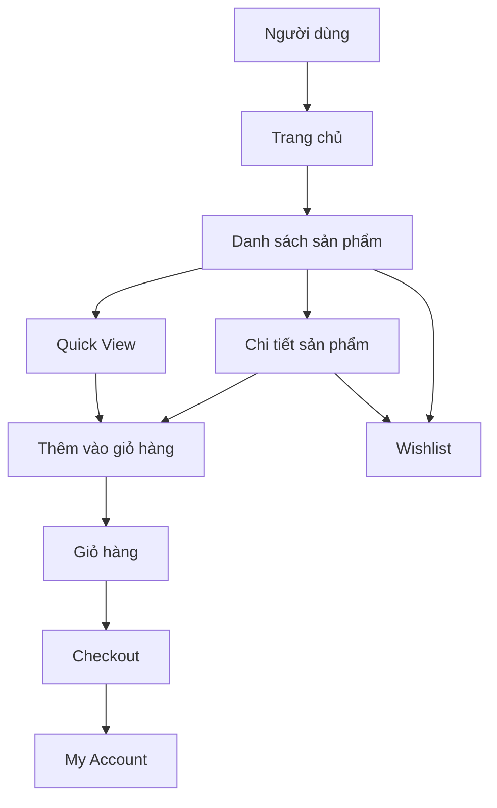
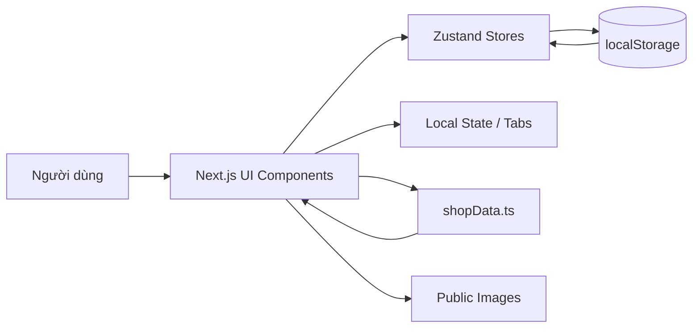
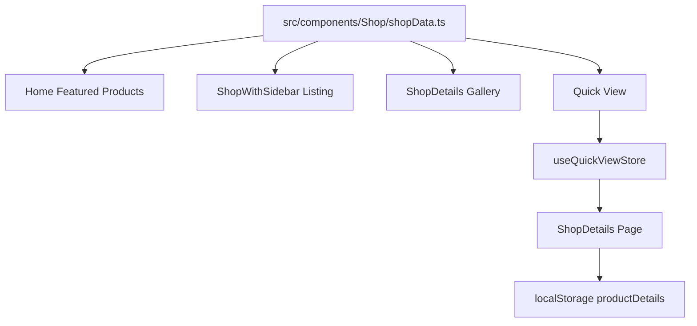
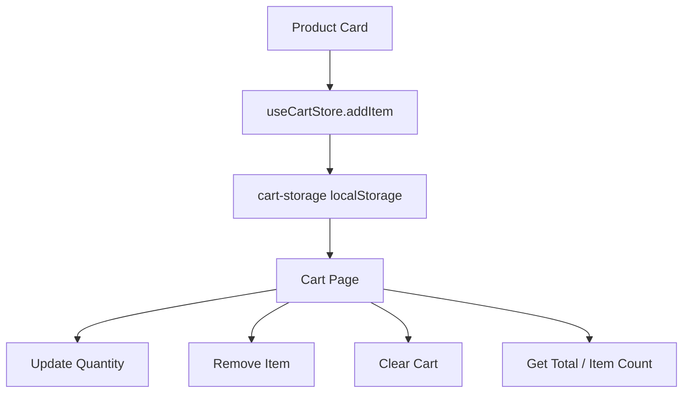
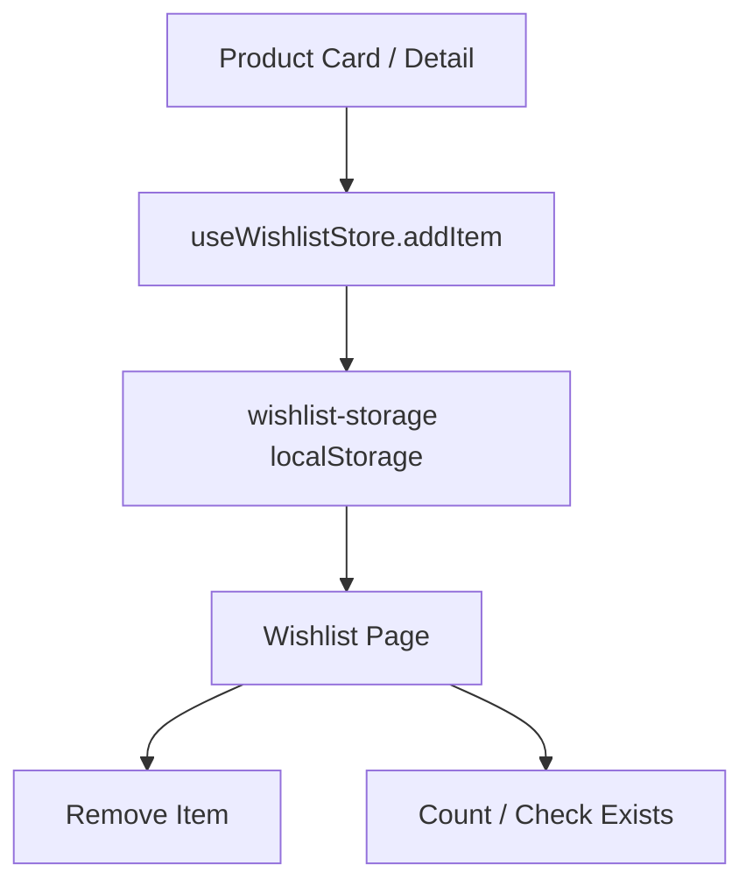
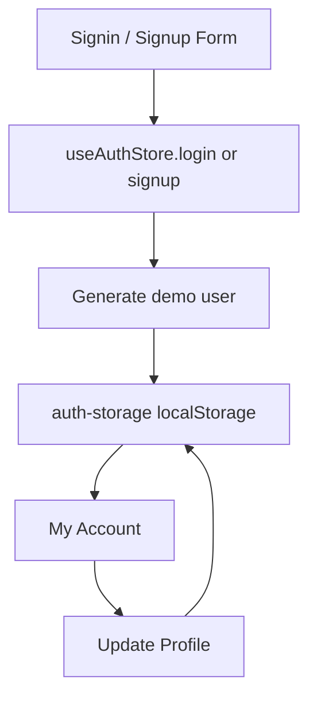
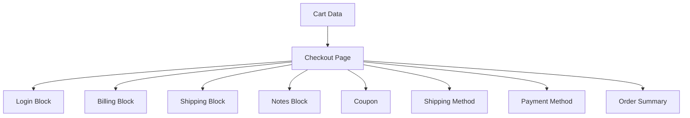
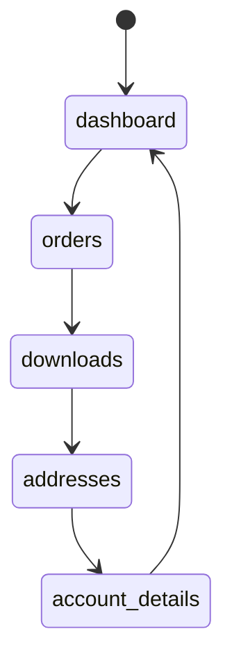
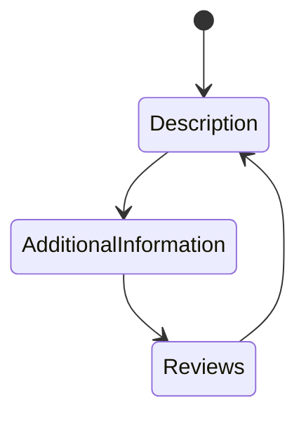

# Sơ đồ Mermaid

## 1. Tổng quan luồng người dùng

## 2. Kiến trúc người dùng -> hệ thống

## 3. Luồng dữ liệu sản phẩm

## 4. Luồng giỏ hàng

## 5. Luồng wishlist

## 6. Luồng auth demo

## 7. Luồng checkout

## 8. Luồng tab My Account

## 9. Luồng tab chi tiết sản phẩm

