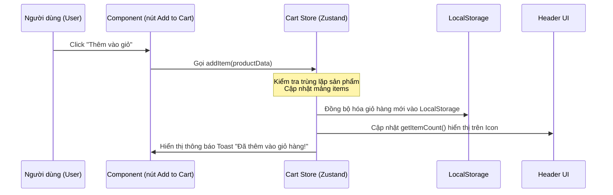
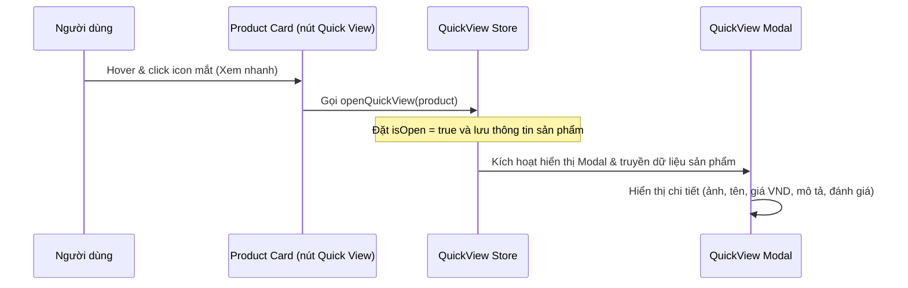
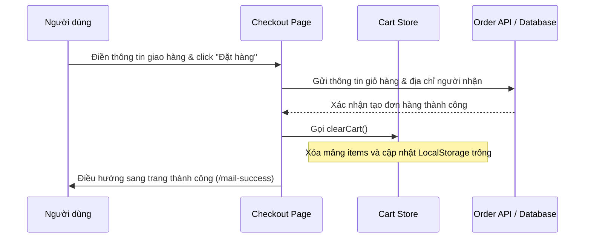

# Tổng Hợp Hàm & Luồng Xử Lý (Workflow) Hệ Thống TechMart

Tài liệu này tổng hợp toàn bộ các hàm cốt lõi, cơ chế quản lý trạng thái (state) và các luồng xử lý chính trong ứng dụng TechMart giúp bạn dễ dàng nắm bắt cấu trúc và trả lời trôi chảy khi bị hỏi.

---

## 1. Cơ chế Quản lý Trạng thái & Các Hàm chính (Stores)

Hệ thống sử dụng **Zustand** để quản lý trạng thái tập trung và tự động lưu trạng thái vào Client Storage.

### A. Quản lý Giỏ hàng (`cartStore.ts`)
Được lưu tại: [cartStore.ts](file:///f:/Workspace/E-commerce/src/store/cartStore.ts)
*   **`addItem(item)`**: 
    *   *Nhiệm vụ:* Thêm sản phẩm vào giỏ hàng.
    *   *Workflow:* Kiểm tra sản phẩm đã tồn tại hay chưa (dựa trên `id`, `size`, `color`). Nếu có rồi thì tăng số lượng (`quantity`), nếu chưa có thì đẩy (`push`) sản phẩm mới vào danh sách.
*   **`removeItem(id)`**:
    *   *Nhiệm vụ:* Xóa sản phẩm khỏi giỏ hàng dựa vào ID.
    *   *Workflow:* Sử dụng hàm `.filter()` để loại bỏ sản phẩm chỉ định ra khỏi mảng `items`.
*   **`updateQuantity(id, quantity)`**:
    *   *Nhiệm vụ:* Thay đổi số lượng sản phẩm trực tiếp từ ô tăng/giảm trong giỏ hàng.
    *   *Workflow:* Duyệt mảng bằng `.map()`, tìm sản phẩm có ID khớp và cập nhật trường `quantity`.
*   **`clearCart()`**:
    *   *Nhiệm vụ:* Làm rỗng giỏ hàng sau khi thanh toán thành công.
*   **`getTotal()`**:
    *   *Nhiệm vụ:* Tính tổng tiền giỏ hàng (USD).
    *   *Workflow:* Sử dụng `.reduce()` tích lũy: `total + price * quantity`.
*   **`getItemCount()`**:
    *   *Nhiệm vụ:* Tính tổng số lượng sản phẩm hiển thị trên icon giỏ hàng ở Header.
    *   *Workflow:* Sử dụng `.reduce()` để cộng dồn tất cả `quantity`.
*   *Tính năng nổi bật:* Có tích hợp `persist` middleware, tự động lưu thông tin giỏ hàng vào `localStorage` của trình duyệt dưới tên `cart-storage`.

### B. Xem Nhanh Sản Phẩm (`quickViewStore.ts`)
Được lưu tại: [quickViewStore.ts](file:///f:/Workspace/E-commerce/src/store/quickViewStore.ts)
*   **`openQuickView(product)`**: Kích hoạt hiển thị Modal xem nhanh và đưa thông tin sản phẩm tương ứng vào biến `product` để hiển thị.
*   **`closeQuickView()`**: Tắt Modal xem nhanh và đặt `product` về `null`.

### C. Quản lý Danh Sách Yêu Thích (`wishlistStore.ts`)
Tương tự giỏ hàng, chứa các hàm:
*   `addItem(item)`: Thêm sản phẩm vào danh sách yêu thích.
*   `removeItem(id)`: Xóa khỏi danh sách.
*   `clearWishlist()`: Làm sạch danh sách yêu thích.
*   Được cấu hình `persist` để lưu trữ trong `localStorage`.

---

## 2. Hàm Tiện Ích Định Dạng Tiền Tệ (`currency.ts`)
Được lưu tại: [currency.ts](file:///f:/Workspace/E-commerce/src/utils/currency.ts)
*   **`formatVND(usdAmount)`**:
    *   *Nhiệm vụ:* Chuyển đổi mệnh giá sản phẩm từ Đô-la Mỹ (USD) sang Đồng Việt Nam (VND) và định dạng hiển thị đẹp mắt.
    *   *Tỷ giá áp dụng:* `USD_TO_VND_RATE = 26364.99` VND/USD.
    *   *Workflow:* Nhân số tiền USD với tỷ giá ➔ Sử dụng đối tượng tiêu chuẩn `Intl.NumberFormat("vi-VN", { style: "currency", currency: "VND" })` của JS để thêm ký hiệu `đ` và dấu phân cách hàng nghìn.

---

## 3. Các Luồng Xử Lý Chính (Workflows)

### Luồng 1: Thêm sản phẩm vào giỏ hàng & Cập nhật UI

### Luồng 2: Xem nhanh sản phẩm (Quick View Modal)

### Luồng 3: Thanh toán đơn hàng (Checkout)

---

## 4. Các câu hỏi thường gặp khi bảo vệ/báo cáo

1.  **Dữ liệu giỏ hàng được lưu trữ ở đâu? Tắt trình duyệt có mất không?**
    *   *Trả lời:* Dữ liệu giỏ hàng được quản lý bởi Zustand Store và sử dụng cơ chế `persist` để tự động lưu xuống `localStorage` của trình duyệt. Nhờ đó, ngay cả khi tắt trình duyệt, giỏ hàng vẫn tồn tại.
2.  **Làm thế nào để đổi sang đơn vị tiền tệ VND?**
    *   *Trả lời:* Em lưu trữ giá trị gốc của sản phẩm bằng USD ở Database để phục vụ tính toán. Khi hiển thị ra giao diện, em truyền giá trị đó qua hàm tiện ích `formatVND`. Hàm này nhân với tỷ giá hiện tại và dùng API `Intl.NumberFormat` tích hợp sẵn của Javascript để tự động định dạng thành dạng tiền tệ VND chuẩn.
3.  **Làm sao để đảm bảo bộ lọc hoặc đường dẫn không bị lỗi khi Việt hóa?**
    *   *Trả lời:* Em chỉ thực hiện thay đổi phần nhãn hiển thị (JSX text nodes) và nhãn hiển thị trong danh mục. Tuyệt đối không thay đổi các giá trị logic (như thuộc tính `value` gửi lên API) hay tham số đường dẫn (href trong thẻ `<Link>`), nhờ vậy tính năng lọc và định tuyến hoạt động cực kỳ ổn định.
