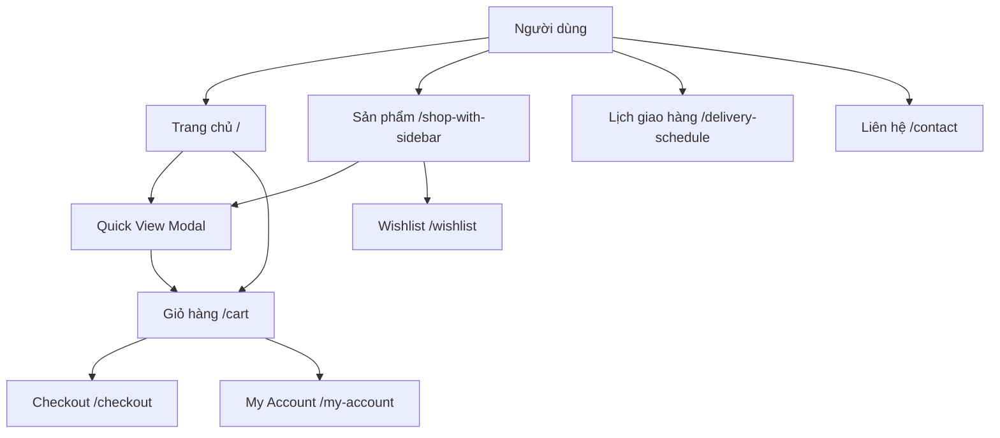
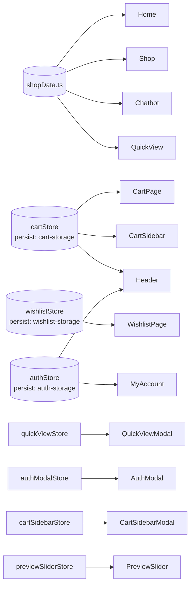
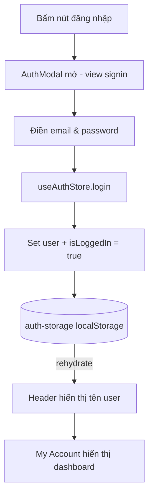

# TechMart E-commerce — Tài liệu dự án toàn diện

> Phiên bản: `0.1.2` · Cập nhật: 2026-07-16  
> Scan và viết lại từ toàn bộ source code thực tế.

---

## Mục lục

1. [Tổng quan](#1-tổng-quan)
2. [Stack công nghệ](#2-stack-công-nghệ)
3. [Cấu hình & Build](#3-cấu-hình--build)
4. [Cấu trúc thư mục](#4-cấu-trúc-thư-mục)
5. [Routing — Danh sách tất cả trang](#5-routing--danh-sách-tất-cả-trang)
6. [Layout hệ thống](#6-layout-hệ-thống)
7. [Components chi tiết](#7-components-chi-tiết)
8. [Zustand Stores](#8-zustand-stores)
9. [Types & Interfaces](#9-types--interfaces)
10. [Utilities & Hooks](#10-utilities--hooks)
11. [Dữ liệu tĩnh (Static Data)](#11-dữ-liệu-tĩnh-static-data)
12. [Sơ đồ luồng dữ liệu](#12-sơ-đồ-luồng-dữ-liệu)
13. [LocalStorage keys](#13-localstorage-keys)
14. [Hướng dẫn vận hành](#14-hướng-dẫn-vận-hành)
15. [Giới hạn & Ghi chú kỹ thuật](#15-giới-hạn--ghi-chú-kỹ-thuật)

---

## 1. Tổng quan

**TechMart** là website thương mại điện tử frontend-only, mô phỏng đầy đủ luồng mua hàng từ trang chủ đến checkout. Toàn bộ là giao diện tĩnh — không có backend, không có database thật.

### Các tính năng đang hoạt động

| Tính năng | Mô tả |
|---|---|
| Trang chủ | Hero banner, danh mục, sản phẩm nổi bật, best seller, newsletter |
| Danh sách sản phẩm | Grid/List view, sidebar filter, sắp xếp |
| Quick View | Modal xem nhanh sản phẩm |
| Chi tiết sản phẩm | Gallery, chọn options, tab mô tả/specs/reviews, recently viewed |
| Giỏ hàng | CRUD items, discount, order summary, sidebar modal |
| Checkout | Form đa khối: billing, shipping, payment, coupon |
| Wishlist | Lưu/xoá yêu thích, persist qua refresh |
| My Account | Dashboard với 5 tab: dashboard, orders, downloads, addresses, account details |
| Auth | Đăng nhập / Đăng ký demo (fake auth, lưu localStorage) |
| Lịch giao hàng | Chọn ngày, nhập ghi chú, đặt lịch giao hàng |
| Chatbot | Bot trả lời tự động theo keyword |
| Liên hệ | Trang form liên hệ |

---

## 2. Stack công nghệ

| Package | Phiên bản | Mục đích |
|---|---|---|
| `next` | ^16.1.6 | Framework React, App Router |
| `react` | ^19.2.0 | UI library |
| `typescript` | 5.2.2 | Kiểu dữ liệu tĩnh |
| `tailwindcss` | 3.3.3 | Utility-first CSS |
| `zustand` | ^4.5.7 | State management client-side |
| `@mui/material` | ^9.2.0 | UI component nâng cao (Card, Button, TextField...) |
| `@mui/x-date-pickers` | ^9.9.0 | Calendar UI (DateCalendar) |
| `@emotion/react` + `@emotion/styled` | ^11.x | CSS-in-JS runtime cho MUI |
| `dayjs` | ^1.11.21 | Xử lý ngày tháng |
| `swiper` | ^10.2.0 | Carousel / slider |
| `react-hot-toast` | ^2.4.1 | Toast notification |
| `react-range-slider-input` | ^3.0.7 | Slider giá trong filter |
| `uuid` | ^14.0.1 | Tạo ID ngẫu nhiên cho auth demo |
| `@mui/icons-material` | ^9.2.0 | Icon set của MUI |

---

## 3. Cấu hình & Build

### `next.config.js`

```js
const nextConfig = {
  output: 'export',       // Build ra web tĩnh (thư mục out/)
  trailingSlash: true,    // URL luôn kết thúc bằng /
  images: {
    unoptimized: true,    // Không dùng Next.js Image Optimization (vì static export)
  },
};
```

### Hệ quả quan trọng

- **Không dùng được:** API Routes, Server Actions, `getServerSideProps`, Dynamic Routes có server logic.
- **Deploy lên:** Vercel (static), Netlify, GitHub Pages, S3, Nginx.
- Mọi trang phải có file `page.tsx` tương ứng — Next.js tạo HTML tĩnh khi build.

### Scripts

```bash
npm run dev     # Chạy dev server (localhost:3000)
npm run build   # Build production → thư mục out/
npm run start   # Chạy bản production build
npm run lint    # Kiểm tra lint (chỉ lint next.config.js)
```

---

## 4. Cấu trúc thư mục

```
F:/Workspace/E-commerce/
├── src/
│   ├── app/                          # Next.js App Router
│   │   ├── layout.tsx                # Root layout (font, global CSS)
│   │   ├── (site)/
│   │   │   ├── layout.tsx            # Site layout (Header, Footer, Modals, Chatbot)
│   │   │   ├── page.tsx              # Trang chủ /
│   │   │   └── (pages)/
│   │   │       ├── cart/page.tsx               # /cart
│   │   │       ├── checkout/page.tsx           # /checkout
│   │   │       ├── contact/page.tsx            # /contact
│   │   │       ├── delivery-schedule/page.tsx  # /delivery-schedule ✨ MỚI
│   │   │       ├── my-account/page.tsx         # /my-account
│   │   │       ├── shop-with-sidebar/page.tsx  # /shop-with-sidebar
│   │   │       └── wishlist/page.tsx           # /wishlist
│   │   └── css/
│   │       ├── style.css
│   │       └── euclid-circular-a-font.css
│   │
│   ├── components/
│   │   ├── Auth/
│   │   │   ├── AuthModal.tsx         # Modal chứa Signin/Signup
│   │   │   ├── Signin/index.tsx      # Form đăng nhập
│   │   │   └── Signup/index.tsx      # Form đăng ký
│   │   ├── Calender/
│   │   │   └── orderCalender.tsx     # Lịch giao hàng (MUI DateCalendar) ✨ MỚI
│   │   ├── Cart/
│   │   │   ├── index.tsx             # Trang giỏ hàng
│   │   │   ├── SingleItem.tsx        # Card 1 item trong giỏ
│   │   │   ├── Discount.tsx          # Input mã giảm giá
│   │   │   └── OrderSummary.tsx      # Bảng tổng tiền
│   │   ├── Chatbot/
│   │   │   └── mockChat.ts           # Logic bot trả lời theo keyword
│   │   ├── Checkout/
│   │   │   ├── index.tsx             # Trang thanh toán (orchestrator)
│   │   │   ├── Billing.tsx           # Khối thông tin thanh toán
│   │   │   ├── Shipping.tsx          # Khối địa chỉ giao hàng
│   │   │   ├── Notes.tsx             # Ghi chú đơn hàng
│   │   │   ├── Coupon.tsx            # Nhập mã coupon
│   │   │   ├── ShippingMethod.tsx    # Chọn phương thức vận chuyển
│   │   │   ├── PaymentMethod.tsx     # Chọn phương thức thanh toán
│   │   │   └── OrderList.tsx         # Danh sách sản phẩm trong checkout
│   │   ├── Common/
│   │   │   ├── Breadcrumb.tsx        # Thanh điều hướng breadcrumb
│   │   │   ├── Newsletter.tsx        # Form đăng ký nhận tin
│   │   │   ├── PreLoader.tsx         # Màn hình loading 1 giây khi vào trang
│   │   │   ├── PreviewSlider.tsx     # Modal slider ảnh sản phẩm
│   │   │   ├── ProductItem.tsx       # Card sản phẩm chung
│   │   │   ├── QuickViewModal.tsx    # Modal xem nhanh sản phẩm
│   │   │   └── CartSidebarModal/
│   │   │       ├── index.tsx         # Sidebar giỏ hàng slide từ phải
│   │   │       ├── SingleItem.tsx    # Item trong sidebar cart
│   │   │       └── EmptyCart.tsx     # UI giỏ trống
│   │   ├── Contact/
│   │   │   └── index.tsx             # Trang liên hệ
│   │   ├── Footer/
│   │   │   └── index.tsx             # Footer toàn trang
│   │   ├── Header/
│   │   │   ├── index.tsx             # Header toàn trang
│   │   │   ├── menuData.ts           # Dữ liệu menu nav
│   │   │   ├── Dropdown.tsx          # Dropdown submenu
│   │   │   └── CustomSelect.tsx      # Select tùy chỉnh trong header
│   │   ├── Home/
│   │   │   ├── index.tsx             # Trang chủ (orchestrator)
│   │   │   ├── BestSeller/
│   │   │   │   ├── index.tsx         # Section best seller
│   │   │   │   └── SingleItem.tsx    # Card sản phẩm best seller
│   │   │   ├── Categories/
│   │   │   │   ├── index.tsx         # Section danh mục
│   │   │   │   ├── SingleItem.tsx    # Card 1 danh mục
│   │   │   │   └── categoryData.ts   # Dữ liệu danh mục tĩnh
│   │   │   └── Orders/
│   │   │       ├── index.tsx         # Bảng đơn hàng trong My Account
│   │   │       └── ordersData.tsx    # Dữ liệu đơn hàng mẫu (3 đơn)
│   │   ├── MyAccount/
│   │   │   ├── index.tsx             # Dashboard tài khoản (5 tabs)
│   │   │   ├── tabsData.tsx          # Dữ liệu icon & title các tab
│   │   │   └── AddressModal.tsx      # Modal chỉnh sửa địa chỉ
│   │   ├── Shop/
│   │   │   ├── shopData.ts           # Dữ liệu tất cả sản phẩm (nguồn chính)
│   │   │   ├── SingleGridItem.tsx    # Card sản phẩm dạng grid
│   │   │   └── SingleListItem.tsx    # Card sản phẩm dạng list
│   │   ├── ShopWithSidebar/
│   │   │   ├── index.tsx             # Trang shop với sidebar filter
│   │   │   ├── CategoryDropdown.tsx  # Filter danh mục
│   │   │   ├── ColorsDropdwon.tsx    # Filter màu sắc
│   │   │   ├── GenderDropdown.tsx    # Filter giới tính
│   │   │   ├── PriceDropdown.tsx     # Filter giá (range slider)
│   │   │   ├── SizeDropdown.tsx      # Filter size
│   │   │   └── CustomSelect.tsx      # Select sắp xếp
│   │   └── Wishlist/
│   │       ├── index.tsx             # Trang wishlist
│   │       └── SingleItem.tsx        # Card 1 item trong wishlist
│   │
│   ├── store/                        # Zustand stores
│   │   ├── index.ts                  # Re-export tất cả stores
│   │   ├── cartStore.ts              # Giỏ hàng (persist)
│   │   ├── wishlistStore.ts          # Yêu thích (persist)
│   │   ├── authStore.ts              # Auth demo (persist)
│   │   ├── authModalStore.ts         # Trạng thái modal auth
│   │   ├── quickViewStore.ts         # Quick view modal
│   │   ├── cartSidebarModalStore.ts  # Cart sidebar modal
│   │   └── previewSliderStore.ts     # Preview slider modal
│   │
│   ├── hooks/
│   │   └── useClickOutside.ts        # Custom hook đóng dropdown/modal khi click ngoài
│   │
│   ├── types/
│   │   ├── product.ts                # Type Product (shopData)
│   │   ├── category.ts               # Type Category
│   │   ├── Menu.ts                   # Type Menu item
│   │   └── testimonial.ts            # Type Testimonial
│   │
│   └── utils/
│       └── currency.ts               # formatVND() — chuyển USD → VND
│
├── public/
│   └── images/                       # Ảnh sản phẩm, banner, avatar
├── docs/                             # Tài liệu dự án
├── next.config.js
├── tailwind.config.js
├── tsconfig.json
└── package.json
```

---

## 5. Routing — Danh sách tất cả trang

| URL | File | Component chính | Ghi chú |
|---|---|---|---|
| `/` | `(site)/page.tsx` | `Home/index.tsx` | Trang chủ |
| `/shop-with-sidebar` | `(pages)/shop-with-sidebar/page.tsx` | `ShopWithSidebar/index.tsx` | Danh sách sản phẩm |
| `/cart` | `(pages)/cart/page.tsx` | `Cart/index.tsx` | Giỏ hàng |
| `/checkout` | `(pages)/checkout/page.tsx` | `Checkout/index.tsx` | Thanh toán |
| `/wishlist` | `(pages)/wishlist/page.tsx` | `Wishlist/index.tsx` | Danh sách yêu thích |
| `/my-account` | `(pages)/my-account/page.tsx` | `MyAccount/index.tsx` | Tài khoản người dùng |
| `/contact` | `(pages)/contact/page.tsx` | `Contact/index.tsx` | Liên hệ |
| `/delivery-schedule` | `(pages)/delivery-schedule/page.tsx` | `Calender/orderCalender.tsx` | Lịch giao hàng ✨ |

### Menu điều hướng (`menuData.ts`)

```
Trang chủ          → /
Sản phẩm           → /shop-with-sidebar
Liên hệ            → /contact
Tài khoản ▾
  ├── Thanh toán   → /checkout
  ├── Giỏ hàng    → /cart
  ├── Yêu thích   → /wishlist
  └── Tài khoản của tôi → /my-account
Lịch giao hàng     → /delivery-schedule  ✨ MỚI
```

---

## 6. Layout hệ thống

### `src/app/(site)/layout.tsx` — Site Layout

Wrap tất cả các trang trong site, render theo thứ tự:

```
PreLoader (1 giây)
→ Header
→ {children}           ← nội dung từng trang
→ QuickViewModal       ← modal xem nhanh sản phẩm
→ CartSidebarModal     ← sidebar giỏ hàng trượt phải
→ PreviewSliderModal   ← modal slider ảnh fullscreen
→ Footer
→ AuthModal            ← modal đăng nhập / đăng ký
→ Chatbot              ← chatbot nổi góc phải màn hình
```

> Layout này là `"use client"` vì dùng `useState`/`useEffect` để kiểm soát PreLoader.

---

## 7. Components chi tiết

### 7.1. Header (`src/components/Header/index.tsx`)

- Logo + ô tìm kiếm sản phẩm.
- Navigation menu từ `menuData.ts` với support submenu dropdown.
- Icon giỏ hàng hiển thị số lượng item từ `useCartStore.getItemCount()`.
- Click icon cart → mở `CartSidebarModal` qua `useCartSidebarModal`.

---

### 7.2. Trang chủ (`src/components/Home/index.tsx`)

Sections theo thứ tự từ trên xuống:

1. **Hero Banner** — Swiper carousel banner lớn.
2. **Categories** — Lưới danh mục từ `categoryData.ts`.
3. **Featured Products** — Lấy `shopData.slice(0, 6)`.
4. **Best Seller** — Section sản phẩm bán chạy.
5. **Newsletter** — Form đăng ký email.

---

### 7.3. Shop (`src/components/ShopWithSidebar/index.tsx`)

| State | Kiểu | Chức năng |
|---|---|---|
| `productStyle` | `"grid"/"list"` | Toggle hiển thị dạng grid hay list |
| `productSidebar` | `boolean` | Mở/đóng sidebar filter trên mobile |
| `stickyMenu` | `boolean` | Sticky nút toggle sidebar khi scroll |

**Sidebar filters** (UI mô phỏng, chưa có logic lọc thật qua state):
- `CategoryDropdown` — lọc theo danh mục.
- `ColorsDropdwon` — lọc theo màu.
- `GenderDropdown` — lọc theo giới tính.
- `PriceDropdown` — range slider giá dùng `react-range-slider-input`.
- `SizeDropdown` — lọc theo size/dung lượng.

---

### 7.4. Giỏ hàng (`src/components/Cart/index.tsx`)

- Đọc items từ `useCartStore`.
- Khi cart rỗng: hiển thị UI empty với CTA sang shop.
- `Discount.tsx` — input mã giảm giá (UI only, chưa có logic thật).
- `OrderSummary.tsx` — tổng tiền tính từ `cartStore.getTotal()`.
- `CartSidebarModal` — sidebar slide từ phải, xem nhanh giỏ, điều hướng checkout.

---

### 7.5. Checkout (`src/components/Checkout/index.tsx`)

Form đa khối, mỗi khối là component riêng:

| Component | Chức năng |
|---|---|
| `Billing.tsx` | Họ tên, email, số điện thoại người mua |
| `Shipping.tsx` | Địa chỉ giao hàng |
| `Notes.tsx` | Ghi chú đơn hàng |
| `Coupon.tsx` | Input mã coupon (UI only) |
| `ShippingMethod.tsx` | Chọn phương thức vận chuyển |
| `PaymentMethod.tsx` | MB Bank, MoMo, COD, PayPal (UI only) |
| `OrderList.tsx` | Danh sách sản phẩm review trước khi đặt |

> ⚠️ `OrderList.tsx` hiện **hard-code** — chưa kết nối động với `cartStore`.

---

### 7.6. My Account (`src/components/MyAccount/index.tsx`)

Tab state quản lý bằng `useState` local (`activeTab`), chưa tách ra store riêng.

| Tab key | Nội dung |
|---|---|
| `dashboard` | Chào mừng người dùng, giới thiệu tổng quan |
| `orders` | Bảng 3 đơn hàng mẫu từ `ordersData`, có modal chi tiết |
| `downloads` | Placeholder: "Bạn không có tải xuống gì cả" |
| `addresses` | Địa chỉ giao hàng & thanh toán, có `AddressModal` để sửa |
| `account-details` | Chỉnh sửa thông tin cá nhân và đổi mật khẩu |

---

### 7.7. Auth (`src/components/Auth/`)

- `AuthModal.tsx` — Modal chứa 2 view Signin/Signup, chuyển qua `useAuthModalStore.switchView()`.
- `Signin/index.tsx` — Form email + password, gọi `useAuthStore.login()`.
- `Signup/index.tsx` — Form name + email + password, gọi `useAuthStore.signup()`.

> ⚠️ **Fake auth** — không xác thực thật. Chỉ cần điền đủ field là set state đăng nhập.

---

### 7.8. Lịch giao hàng (`src/components/Calender/orderCalender.tsx`) ✨ MỚI

**`"use client"` component** — bắt buộc vì dùng `useState` và thư viện MUI.

| State | Kiểu | Mục đích |
|---|---|---|
| `selectedDate` | `Dayjs` | Ngày đang được chọn (default: hôm nay) |
| `note` | `string` | Ghi chú / nội dung đơn hàng |
| `orders` | `Array<{date: string, note: string}>` | Danh sách lịch đã đặt trong session |

**Tính năng:**
- `DateCalendar` của MUI X — chọn ngày, chặn ngày quá khứ (`disablePast`).
- `LocalizationProvider` + `AdapterDayjs` để format ngày.
- Nhập ghi chú qua `TextField`.
- Bấm nút → push vào mảng `orders`, reset `note`.
- Danh sách lịch đã đặt render bên dưới dạng `Card`.

> ⚠️ **Chưa persist** — refresh/tắt trình duyệt sẽ mất toàn bộ lịch đã đặt.

---

### 7.9. Chatbot (`src/components/Chatbot/mockChat.ts`)

Hoạt động bằng keyword matching đơn giản:

| Input | Phản hồi |
|---|---|
| `"Xin chào"` | Lời chào |
| `"Bảng giá sản phẩm"` | Bảng text liệt kê toàn bộ sản phẩm từ `shopData` |
| `"Liên hệ hỗ trợ"` | Hotline + email hỗ trợ |
| `"Cảm ơn"` / `"Tạm biệt"` | Phản hồi xã giao |
| Khác | Default reply |

---

### 7.10. Common Components

| Component | Vị trí | Mô tả |
|---|---|---|
| `Breadcrumb.tsx` | Đầu mỗi trang | Thanh điều hướng vị trí trang |
| `PreLoader.tsx` | Toàn site | Loading spinner 1s khi mở site |
| `Newsletter.tsx` | Cuối trang chủ | Form nhập email đăng ký nhận tin |
| `QuickViewModal.tsx` | Overlay toàn site | Modal xem nhanh thông tin sản phẩm |
| `PreviewSlider.tsx` | Overlay toàn site | Modal fullscreen slider ảnh sản phẩm |
| `CartSidebarModal/` | Slide từ phải | Sidebar giỏ hàng khi click icon cart |

---

## 8. Zustand Stores

### Tổng quan 7 stores

```
src/store/index.ts  ← re-export tất cả
├── cartStore.ts              persist → localStorage: "cart-storage"
├── wishlistStore.ts          persist → localStorage: "wishlist-storage"
├── authStore.ts              persist → localStorage: "auth-storage"
├── authModalStore.ts         KHÔNG persist (session only)
├── quickViewStore.ts         KHÔNG persist (session only)
├── cartSidebarModalStore.ts  KHÔNG persist (session only)
└── previewSliderStore.ts     KHÔNG persist (session only)
```

---

### 8.1. `cartStore` — Giỏ hàng

**Interface `CartItem`:**
```ts
{
  id: string;
  title: string;
  price: number;
  image: string;
  quantity: number;
  size?: string;
  color?: string;
}
```

| Action | Mô tả |
|---|---|
| `addItem(item)` | Thêm vào giỏ. Nếu trùng `id + size + color` → cộng dồn `quantity` |
| `removeItem(id)` | Xóa theo `id` |
| `updateQuantity(id, qty)` | Cập nhật số lượng |
| `clearCart()` | Xóa toàn bộ giỏ |
| `getTotal()` | Tính tổng tiền (`price × quantity` tất cả items) |
| `getItemCount()` | Tổng số lượng tất cả items |

---

### 8.2. `wishlistStore` — Yêu thích

**Interface `WishlistItem`:**
```ts
{
  id: string;
  title: string;
  price: number;
  image: string;
  category?: string;
}
```

| Action | Mô tả |
|---|---|
| `addItem(item)` | Thêm vào wishlist (bỏ qua nếu đã có) |
| `removeItem(id)` | Xóa khỏi wishlist |
| `isInWishlist(id)` | Kiểm tra sản phẩm có trong wishlist không → `boolean` |
| `getItemCount()` | Đếm số lượng item |
| `clearWishlist()` | Xóa toàn bộ |

---

### 8.3. `authStore` — Auth Demo

**Interface `User`:**
```ts
{
  id: string;       // UUID tự sinh (uuid v4)
  email: string;
  name: string;
  phone?: string;
  address?: string;
  city?: string;
  state?: string;
  zipCode?: string;
  country?: string;
}
```

| Action | Mô tả |
|---|---|
| `login(email, password)` | Set user nếu cả 2 không rỗng. Name tự sinh từ email |
| `signup(email, password, name)` | Set user mới với UUID |
| `logout()` | Reset `user = null`, `isLoggedIn = false` |
| `updateProfile(partial)` | Cập nhật từng phần thông tin user với `Partial<User>` |

---

### 8.4. `authModalStore` — Modal Auth

```ts
isOpen: boolean
view: 'signin' | 'signup'
openModal(view?)    // mở modal, default view: 'signin'
closeModal()
switchView(view)    // chuyển giữa signin ↔ signup
```

---

### 8.5. `quickViewStore` — Quick View

```ts
isOpen: boolean
product: Product | null
openQuickView(product: Product)
closeQuickView()
```

---

### 8.6. `cartSidebarModalStore` — Cart Sidebar

```ts
isOpen: boolean
openModal()
closeModal()
```

---

### 8.7. `previewSliderStore` — Preview Slider

```ts
isOpen: boolean
openPreviewModal()
closePreviewModal()
```

---

## 9. Types & Interfaces

### `src/types/product.ts`

```ts
type Product = {
  id: number;
  title: string;
  reviews: number;
  price: number;               // Giá USD gốc
  discountedPrice: number;     // Giá USD sau giảm giá
  description?: string;
  rating?: number;
  category?: string;
  imgs: {
    thumbnails: string[];      // Ảnh nhỏ dùng trong gallery
    previews: string[];        // Ảnh fullscreen trong PreviewSlider
  };
};
```

### `src/types/Menu.ts`

```ts
type Menu = {
  id: number;
  title: string;
  path: string;
  newTab: boolean;
  submenu?: Menu[];
}
```

---

## 10. Utilities & Hooks

### `src/utils/currency.ts`

```ts
export const USD_TO_VND_RATE = 26364.99;

// Chuyển số USD thành chuỗi định dạng VND (vi-VN locale)
// Ví dụ: formatVND(10) → "263.650 ₫"
export const formatVND = (usdAmount: number): string
```

Dùng ở khắp nơi trong toàn bộ app để hiển thị giá tiền VND.

---

### `src/hooks/useClickOutside.ts`

Custom hook generic lắng nghe sự kiện `mousedown` và `touchstart`. Khi phát hiện click ra ngoài vùng `ref`, gọi `handler`. Dùng để tắt Dropdown, Modal khi người dùng click ra ngoài vùng UI đó.

```ts
useClickOutside<T extends HTMLElement>(
  ref: RefObject<T>,
  handler: (event: MouseEvent | TouchEvent) => void
): void
```

---

## 11. Dữ liệu tĩnh (Static Data)

### `src/components/Shop/shopData.ts`

**Nguồn dữ liệu sản phẩm duy nhất** của toàn bộ ứng dụng. Các trang trang chủ, shop listing, quick view và chatbot đều import từ đây.

### `src/components/Home/Categories/categoryData.ts`

Danh sách danh mục sản phẩm hiển thị trên section Categories của trang chủ.

### `src/components/Home/Orders/ordersData.tsx`

3 đơn hàng mẫu cứng dùng trong tab `orders` của My Account:

```ts
[
  { orderId: "1", status: "delivered",  total: "2,300,000", title: "Sunglasses" },
  { orderId: "2", status: "processing", total: "1,000,000", title: "Watchs"     },
  { orderId: "3", status: "delivered",  total: "100,000",   title: "Cancelled"  },
]
```

### `src/components/Header/menuData.ts`

5 mục menu: Trang chủ, Sản phẩm, Liên hệ, Tài khoản (có submenu 4 item), Lịch giao hàng.

---

## 12. Sơ đồ luồng dữ liệu

### Tổng quan luồng người dùng



---

### Luồng State → UI



---

### Luồng Lịch giao hàng

```mermaid
flowchart TD
  A[/delivery-schedule] --> B[OrderCalendar Component]
  B --> C[DateCalendar MUI - Chọn ngày]
  B --> D[TextField - Nhập ghi chú]
  C --> E{Bấm nút Đặt lịch}
  D --> E
  E --> F[local state: thêm vào mảng orders]
  F --> G[Render danh sách lịch đã đặt phía dưới]
```

---

### Luồng giỏ hàng

```mermaid
flowchart TD
  Card[Product Card / QuickView] -->|addItem| CartStore[useCartStore]
  CartStore -->|persist middleware| LS[(cart-storage\nlocalStorage)]
  LS -->|rehydrate khi load app| CartStore
  CartStore --> CartPage[/cart]
  CartStore --> Sidebar[CartSidebarModal]
  CartStore --> Header[Badge số lượng trên Header]
  CartPage -->|removeItem / updateQty / clearCart| CartStore
```

---

### Luồng Auth Demo



---

## 13. LocalStorage keys

| Key | Store | Nội dung được lưu |
|---|---|---|
| `cart-storage` | `cartStore` | Mảng `CartItem[]` |
| `wishlist-storage` | `wishlistStore` | Mảng `WishlistItem[]` |
| `auth-storage` | `authStore` | Object `User` hoặc `null` |

> **Reset dữ liệu:** DevTools (F12) → Application → Local Storage → Xóa key tương ứng.

---

## 14. Hướng dẫn vận hành

### Chạy dev server

```bash
npm install
npm run dev
# Truy cập: http://localhost:3000
```

### Build & Deploy

```bash
npm run build
# Kết quả: thư mục out/
# Deploy out/ lên: Vercel, Netlify, GitHub Pages, Nginx, S3/CloudFront
```

### Thêm trang mới

1. Tạo `src/app/(site)/(pages)/<ten-trang>/page.tsx`.
2. Tạo component trong `src/components/<TenComponent>/index.tsx`.
3. Nếu component dùng hooks/MUI → thêm `"use client"` ở dòng đầu.
4. Thêm route vào `src/components/Header/menuData.ts` nếu muốn hiện trên nav.

### Khi nào PHẢI có `"use client"`?

- Dùng React hooks: `useState`, `useEffect`, `useRef`, `useCallback`...
- Dùng Zustand stores (client-side only).
- Dùng MUI components (yêu cầu Emotion context).
- Dùng browser API: `localStorage`, `window`, `document`.

### Vấn đề thường gặp

| Vấn đề | Nguyên nhân | Giải pháp |
|---|---|---|
| Ảnh không hiển thị | Path ảnh sai | Đảm bảo ảnh trong `public/` và path bắt đầu từ `/` |
| Cart không cập nhật | Browser còn data cũ | Xóa key `cart-storage` trong localStorage |
| Trang trắng sau build | Route thiếu `page.tsx` | Tạo đủ file route trong App Router |
| Hook error trên trang | Thiếu `"use client"` | Thêm directive vào đầu component file |
| Lịch giao hàng bị mất | State local không persist | Refresh trang là mất — chưa implement persistence |

---

## 15. Giới hạn & Ghi chú kỹ thuật

| Hạng mục | Trạng thái | Ghi chú |
|---|---|---|
| Backend / API | ❌ Không có | Toàn bộ là UI mô phỏng |
| Authentication thật | ❌ Fake | Chỉ cần điền form là đăng nhập được |
| Checkout thật | ❌ UI only | `OrderList` hard-code, không nối `cartStore` |
| Sidebar filter logic | ❌ UI only | Filter có UI nhưng chưa lọc dữ liệu thật |
| Lịch giao hàng persist | ❌ Chưa | Dữ liệu mất khi refresh |
| Dữ liệu đơn hàng | ❌ Hard-code | 3 đơn mẫu cứng trong `ordersData.tsx` |
| Redux | ⚠️ Di sản | `src/redux/` vẫn còn trong source nhưng không dùng — layer Zustand là luồng thật |
| Image optimization | ⚠️ Tắt | `unoptimized: true` vì static export |
| Server-side rendering | ❌ Không có | Static export thuần, mọi render ở client |
| Currency | ⚠️ Chuyển đổi | Data lưu USD, hiển thị VND qua `formatVND()` với tỷ giá cứng `26364.99` |
